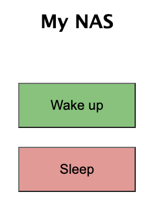
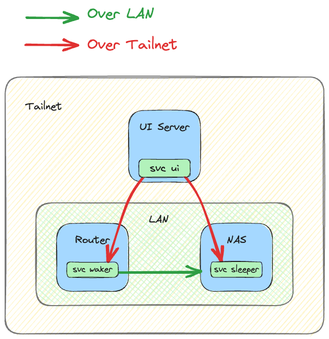
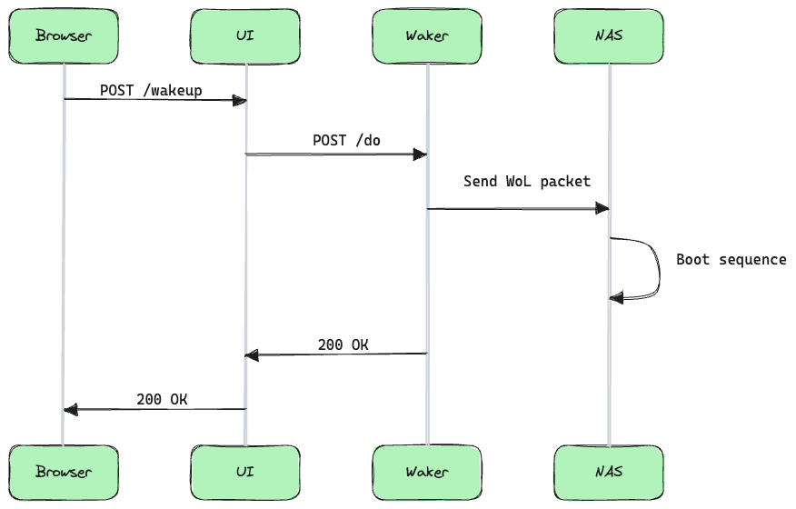
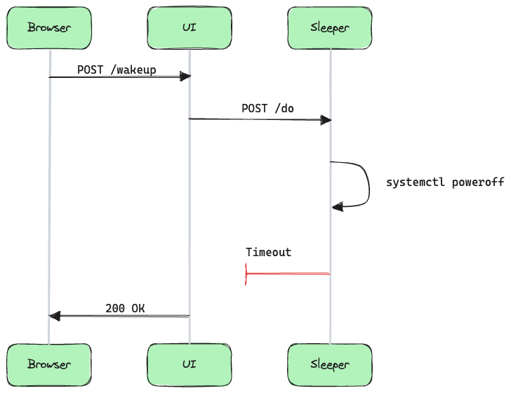

# Introduction

I recently bought a NAS (a [TerraMaster F4-423](https://www.terra-master.com/global/f4-4728.html) if you’re curious). My main uses cases for it are: [Plex](https://www.plex.tv) media server, Samba share, [Resilio Sync](https://www.resilio.com) target. I wanted all that to be accessible from anywhere so I installed [Tailscale](https://tailscale.com) on the NAS and made it join my tailnet.

This is a great setup: the NAS is quite powerful, has room for a lot of disk capacity and thanks to Tailscale I can access it remotely.

My initial plan was to have it always on, however after a couple of weeks that changed because the HDDs were too loud and unfortunately the NAS sits in my work office.

I started to look into shutting it down and waking it up on demand; I vaguely knew about [Wake-on-LAN](https://en.wikipedia.org/wiki/Wake-on-LAN) (abbreviated to WoL in the rest of the article) but I wasn’t sure if it would work correctly with this device.

So I started experimenting a bit with it and everything worked fine. Now that I knew I could boot it up reliably with WoL I started to think about how I could boot it up *remotely* and how I could make the user experience the simplest it could be.

The rest of this post will explain in details what I ended up with and how it’s implemented.

# The goal

I had to accept that syncing with Resilio wouldn’t be instantaneous anymore since I have to first boot up the NAS, however for Plex and my Samba share there would be little to no impact because of how infrequently I use them.

However, I almost exclusively use Plex with my Apple TV and when that happens, I’m sitting on my couch. Now, I may be lazy but when I’m ready to watch a movie I don’t want an initial setup step where I have to pull out my laptop, open a terminal and run a command line tool.

So I thought about a UI that I could open on my phone, click a button and be done with it.

*That was the goal*: something dead simple with two buttons, one to boot up the NAS, one to shut it down.

# What I implemented

Let’s start with the UI. Here’s a screenshot of the only page there is:

As I said before, dead simple. The “Wake up” button wakes up the NAS, the “Sleep” button tells the NAS to shut down.

There are three components to make this work:

- a service listening on the NAS accepting **shutdown requests**
- a service listening on *another* device accepting **wake up requests**
- a service serving the UI

The other device responsible for waking up the NAS must be on the same LAN for WoL to work. In my case this device is a router running Linux.

These services need a way to communicate to each other, and this is where [Tailscale](https://tailscale.com) comes in. All my devices join a single tailnet and can then talk to each other. We’ll go into details about this later on.

The following diagram shows the communication links:

# The magic

Tailscale is the magic component that made this setup trivial to implement. With the [MagicDNS](https://tailscale.com/kb/1081/magicdns/) feature, every device in my tailnet is reachable via its name and the great thing is that *it just works* on both Linux, macOS and my iPhone.
When my device named “router” joins my tailnet, I can then resolve its IP on any device in the tailnet by just using its name.

This might not seem like much but this means that I don’t have to maintain a nameserver myself and I can just hardcode the name in my service code.

Now, I could have just made my services listen on their respective *device’s* IP but I was inspired by [this](https://tailscale.com/blog/tsnet-virtual-private-services/) blog post from Tailscale which explains how to build a *private service* with its own IP and name and everything. This uses the [tsnet](https://pkg.go.dev/tailscale.com/tsnet) Go library.

I ran with this idea and made each of the three components I described earlier a private service, with its own name:

- the *waker* which handles **wake up requests**
- the *sleeper* which handles **shutdown requests**
- the *ui* which serves the UI shown before and dispatch requests to both the *waker* and *sleeper*

Now that we know how services communicate with each other, let’s update the previous diagram to make it more accurate:

Notice that services now talk directly to each other *except* for the *waker* service, that’s because it sends a WoL packet which is actually received by the NAS itself and not by any service I wrote.

Ok, we know what each service should do and how they communicate to each other to do their job: let’s take a deeper look into the actual **wake up** and **shutdown** requests.

# The wake up and shutdown requests

Both requests are actually really simple to implement.

When I’m asking to wake up the NAS the *waker* service will send a WoL packet to the MAC address of the NAS. The following sequence diagram shows the flow:

When I’m asking to shut down the NAS the *sleeper* service will just run `systemctl poweroff`. This has the unfortunate side effect that the request will timeout on the UI side but I can live with that. The following sequence diagram shows the flow:

# Conclusion

This was a fun afternoon project. The code is open source and available on [GitHub](https://github.com/vrischmann/naspm).

There are around 500 lines of Go, HTML and CSS code in there; it should be easy to adapt to your use case if needed.

There are some considerations that I haven’t mentioned, like how to reliably start the services at boot time, how to expose the UI to the internet if necessary, etc. This highly depends on the environment in which this system is deployed and is left as an exercise to the reader.

As for me, I have this system deployed for about a month now and I’m quite happy with it.
